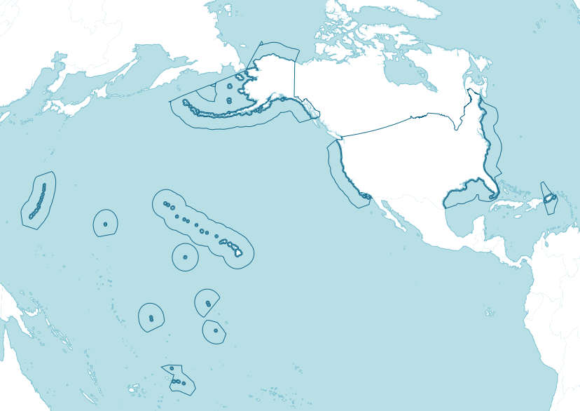

# Moore Foundation Ocean Maps


This project will map a variety of ocean protection areas ranging from thousands of square miles in the Pacific to a few square miles off Massachusetts. The maps use an equal-area projection (specifically a [Lambert Azimuthal Equal Area](http://en.wikipedia.org/wiki/Lambert_azimuthal_equal-area_projection) centered on 105ºW, 40ºN) to reduce distortion, but one of the design challenges will be making that projection intelligible even when the zoom is very close, like in the Cape Cod example.

Another key priority of the client is that  updates are easy. Updates will be of a couple forms:

1. Metadata about a protected area already on the map will change, as when a pending area is approved
2. A new area is added to the map.

In the case of #1, as much non-geo data as possible should be accessed from CSV files that can be edited in any spreadsheet program or text editor. for #2, geo data should be assumed to come as shapefiles with a documented standard format but no programmatic effort to transform non-compliant files to that format. Ideally, such data would be read directly from the filesystem, with no intervening database.

The site will consist of a pre-generated raster basemap (currently hosted on Mapbox) overlaid with clickable and toggleable vector shapes. The basemap will show the EEZs of the US and Canada for context. The vector overlays will show each individual ocean planning process.

## Repo set-up
The Moore repo has [oceanplanning.github.io](https://github.com/oceanplanning/oceanplanning.github.io) loaded as a [submodule](http://git-scm.com/book/en/v2/Git-Tools-Submodules). So after cloning the Moore repo, you will need to run these commands in the root directory to prepare the submodule:
```bash
git submodule init
git submodule update
```

## Branches

Currently only `master`.

## Data preparation

Processing the input shapefiles into GeoJSON vector overlays needs to happen before deployment of the site. Once the data has been processed, these files will not need to change unless the underlying data changes (if new planning areas are added, or their shapes change, etc.) The instructions in this section refer to the clickable overlays that represent ocean planning areas. To modify the basemap tiles (which include the US and Canada EEZs) see the **basemap style** section below.

Currently the data preparation is done using a Makefile. **Note, the specific commands are subject to change!**

If you want to add new planning areas, we need to have a shapefile that describes the spatial extent of the area. Please read the [Shapefile Specifications](SHAPEFILE_SPECIFICATIONS.md) document first.

To get the new planning areas to show up on the map, you need to do three things:

1. Add a new line to the [CSV file](blob/master/assets/csv/data.csv)
2. Edit [MFOM.config.js](blob/master/js/MFOM.config.js), specifically the `layers` array, to include a link between the areas ID in the CSV, and its name in the TopoJSON file.
3. Modify the Makefile to add the new shapefile into the TopoJSON file.

To edit the Makefile, follow the pattern of the other planning areas. You will need to edit the Makefile so that the following steps happen:

1. Download the shapefile from the web (or source it from the repository)
2. Convert the shapefile to GeoJSON and reproject to EPSG:4326 (usually can be done in one step using `ogr2ogr`). Make sure the GeoJSON filename is the same as the topojson_layer name you added to MFOM.config.js in step 2 above.
3. Compile all the GeoJSON files into one TopoJSON (the `topojson` command)

After modifying the makefile, you run `make topojson` to download and process the interactive overlay data that is drawn on the map. This converts all the shapefiles into GeoJSON, and then compiles them into a single TopoJSON file.

## Working on the basemap style

The basemap consists of two almost-identical TileMill projects. One is for the low zoom levels and covers the entire world. The other is for higher zoom levels and only covers the extent of the US and Canada's EEZs. They both use the same stylesheets (only the project.mml files are different).

To modify the basemap style, you need to link the TileMill projects into your local tilemill directory. Do this with the following command:

`make install`

You will now have two TileMill projects called "Moore Foundation lowzoom" and "Moore Foundation highzoom". If you adjust the style in one, it should be reflected automatically in the other. (The `make install` step creates symlinks from one style to the other)

To download and process the base data that is necessary for the raster basemap, run `make basedatalaea`. This creates shapefiles that have been reprojected to Lambert Azimuthal Equal-Area.

## Installation

TBD...

## Usage + Configuration (specifically for libraries)

```javascript
// this is some sample code showing how things are used
```

## Dependencies
* [npm](https://www.npmjs.org/)
* [Gulp](http://gulpjs.com/)

Quick setup:
```bash
npm install --global gulp
npm install --save-dev gulp gulp-autoprefixer gulp-csso gulp-uglify gulp-filter gulp-useref gulp-rev gulp-rev-replace
```

### Software

_(These are implicit dependencies beyond what gets installed during the [installation](#Installation) step.)_

Frontend:

* D3.js
* Leaflet
* Proj4 w/ Proj4Leaflet
* Hasher w/ Signals
* Topojson

The data preparation makefile has these dependencies:

* **GDAL/OGR**, particularly the command `ogr2ogr`: On OSX, install using [Homebrew](http://brew.sh/) and `brew install gdal`
* **topojson**: Install Node.js `brew install node`. Then install topojson with `npm install -g topojson`.

### Data

* CSV meta data about ocean protected areas, economic zones, and potentially other designated areas offshore. Currently we maintain this data in a Google Spreadsheet and periodically export it to the [CSV file](blob/master/assets/csv/data.csv) that is stored in this repository.
* Shapefiles of ocean protected areas. These are processed into a [topojson file](blob/master/assets/geojson/planning_areas.topojson) for display on the map.
* This is a static data project with no database backend.

## How do I test it?
```bash
python -m SimpleHTTPServer` in the root directory
```

## Deployment
From the root directory:
```bash
gulp
```
This will take a minute and all output will be written to `oceanplanning.github.io` submodule.  Once that is done, `cd` into `oceanplanning.github.io` submodule.  Write a commit message, then do a push:
```bash
git push
```
The [Oceanplanning repo](https://github.com/oceanplanning/oceanplanning.github.io) and [Oceanplanning site](https://oceanplanning.org) should be updated.

**IMPORTANT** Make sure you are in the `oceanplanning.github.io` directory when you do the above steps.
