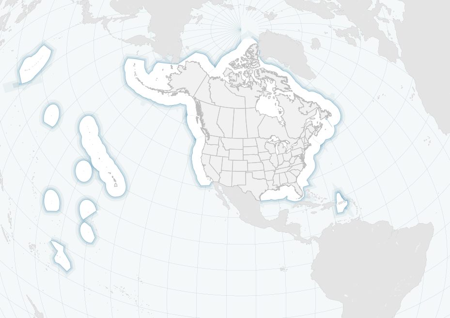

# Moore Foundation Ocean Maps


This project will map a variety of ocean protection areas ranging from thousands of square miles in the Pacific to a few square miles off Massachusetts. The maps use an equal-area projection (specifically a [Lambert Azimuthal Equal Area](http://en.wikipedia.org/wiki/Lambert_azimuthal_equal-area_projection) centered on 105ºW, 40ºN) to reduce distortion, but one of the design challenges will be making that projection intelligible even when the zoom is very close, like in the Cape Cod example.

Another key priority of the client is that  updates are easy. Updates will be of a couple forms:

1. Metadata about a protected area already on the map will change, as when a pending area is approved
2. A new area is added to the map.

In the case of #1, as much non-geo data as possible should be accessed from CSV files that can be edited in any spreadsheet program or text editor. for #2, geo data should be assumed to come as shapefiles with a documented standard format but no programmatic effort to transform non-compliant files to that format. Ideally, such data would be read directly from the filesystem, with no intervening database.

The site will consist of a pre-generated raster basemap (currently hosted on Mapbox) overlaid with clickable and toggleable vector shapes. The basemap will show the EEZs of the US and Canada for context. The vector overlays will show each individual ocean planning process. 

## Branches (if appropriate)

Currently only `master`

## Heroku Apps (if appropriate)

Currently no heroku apps.

## Data preparation

Processing the input shapefiles into raster tiles and GeoJSON vector overlays needs to happen before deployment of the site. Once the data has been processed, these files will not need to change unless the underlying data changes (if new planning areas are added, or their shapes change, etc.) 

Currently the data preparation is done using a Makefile. **Note, the specific commands are subject to change!**

To download and process the base data that is necessary for the raster basemap, run `make basedata`. To convert it into Lambert Azimuthal Equal-Area, run `make basedatalaea`.

To download and process the geojson data, run `make geojson`.

## Working on the basemap style

To modify the basemap style, you need to link the TileMill project into your local tilemill directory. Do this with the following command:

`make install`

You will now have a TileMill project called "Moore".

## Installation

TBD. But it should be very simple.

## Usage + Configuration (specifically for libraries)

```javascript
// this is some sample code showing how things are used
```

## Dependencies

### Software

_(These are implicit dependencies beyond what gets installed during the [installation](#Installation) step.)_

Postgres? Javascript libraries?

### Data

* CSV meta data about ocean protected areas, economic zones, and potentially other designated areas offshore.
* This is a static data project with no database backend.
* At kickoff, it's not known whether we'll need a preprocessor for shapefiles to bake tiles. If so, consider learning from the [EDF project](https://github.com/stamen/edf), which used a Vagrant instance to process data into tiles. Brandon Liu and Eric Gelinas built that system.

### Static Assets

* Location and (basic) description of images, existing CSS, HTML, etc.

## How do I test it?

Test locally by typing `python -m SimpleHTTPServer` in the root directory.

## Deployment

TBD. 
If this is a live thing in the world, how do we push changes to the live thing?