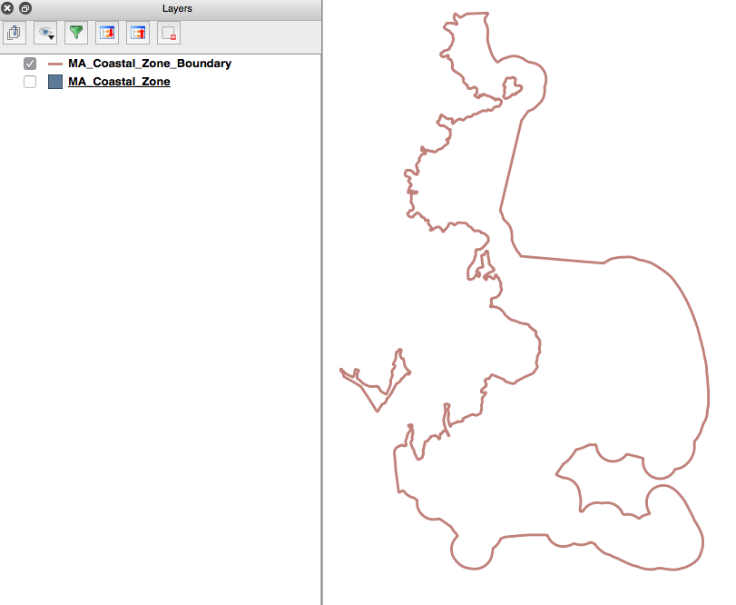
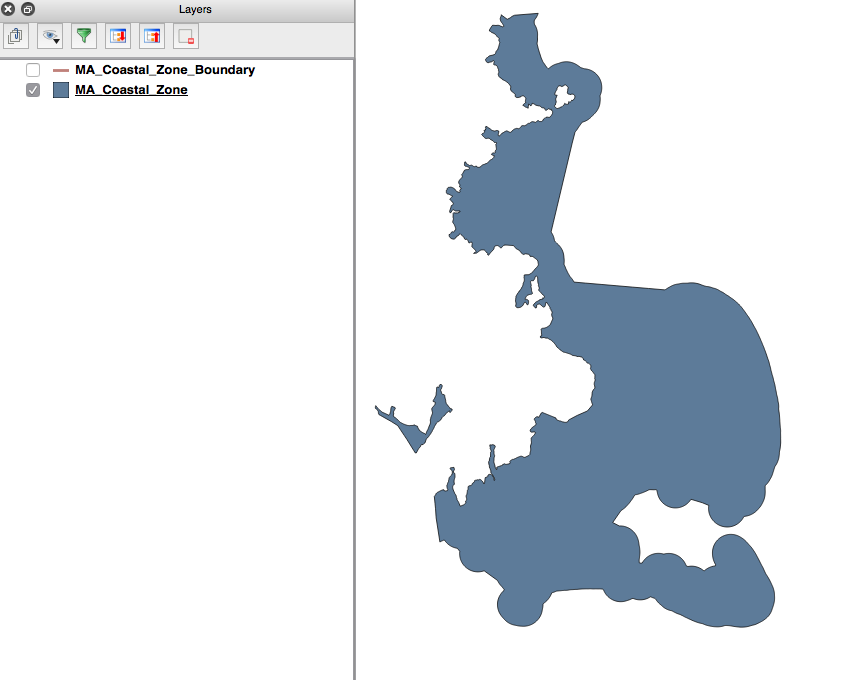
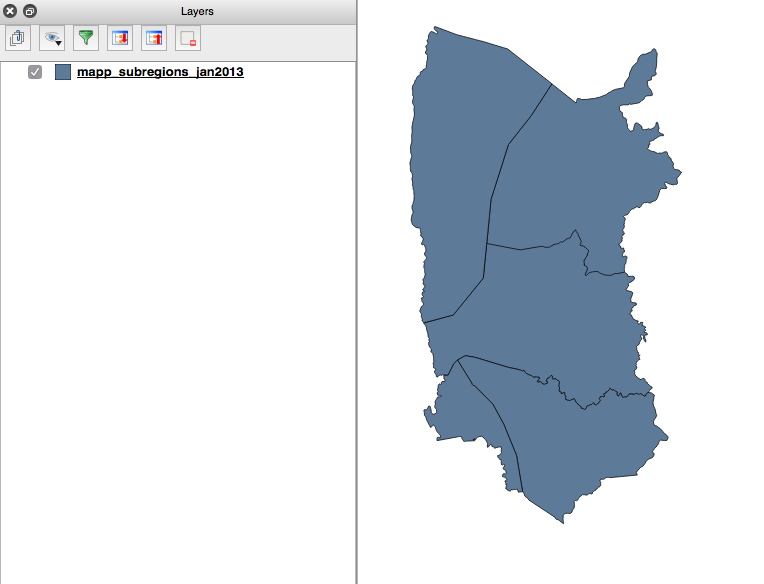
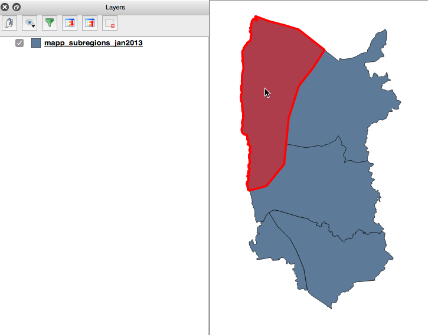
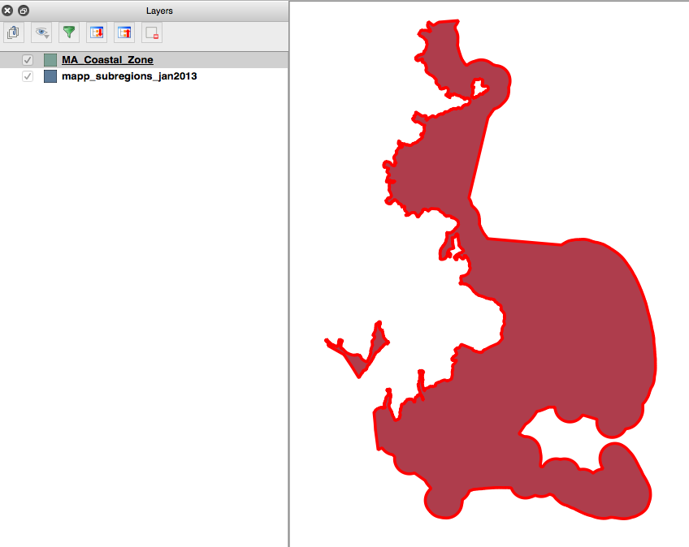

Ocean Planning Shapefile Specifications
===

We need your help finding shapefiles for the ocean planning areas shown on the [oceanplanning.org](http://oceanplanning.org) map.

Summary of specifications
---
The data we want should have the following characteristics: (see below for more details about these requirements)

 1. **ESRI Shapefile** (.shp) format.
 2. **Closed polygons** (not line features demarcating the edge of the areas).
 3. **One feature** per file.

Things we don't care about:
---
 * **Map projection.** We can deal with shapefiles in any common map projection.
 * **Attribute data.** We will ignore any attributes associated with the shapes. We only care about the polygons themselves.

Requirement 1: Shapefile format
---
The ESRI Shapefile format (.shp files) is the easiest for us to work with. In the end, we end up converting all the shapefiles into GeoJSON for display on the web, but it's easier if everything is in Shapefile format to begin with.

Please **do not** send geodatabases, coverages, KML files, or any other format.

Please **do** make sure that you include all the necessary components of the Shapefile. It's easiest if you include all of these files in one zip file when you send it to us. Each "shapefile" requires at least these four files:

 * .shp 	(the shapes themselves)
 * .shx		(an index file)
 * .dbf		(tabular attribute data)
 * .prj		(the projection file)

Requirement 2: Closed polygons
---

Shapefiles can include either points, lines, or polygons. We are only interested in poilygon shapefiles. Please confirm that the shapefile you are sending includes closed area features. Use a GIS program like [ArcGIS Explorer Desktop](http://www.esri.com/software/arcgis/explorer) or [QGIS](http://www.qgis.org/) to view the shapefile before sending.

Here is a planning area represented as a line, not a closed polygon. **NOT** what we want:

Here is the same planning area represented as a closed polygon. This **IS** what we want:

Requirement 3: One feature per file
---

Because we are discarding the attribute data attached to each feature in the shapefiles, we only want one feature per shapefile. It is okay if this feature has multiple polygons (sometimes called a "multipolygon"). However, there should only be one record in the list of features in the shapefile.

Here is a shapefile that includes multiple features. **NOT** what we want:

You can tell they are separate polygons when you click on them:

In this shapefile, we can see that there are multiple polygons that are all part of the same feature, because they are all highlighted when we select them. This **IS** what we want:

